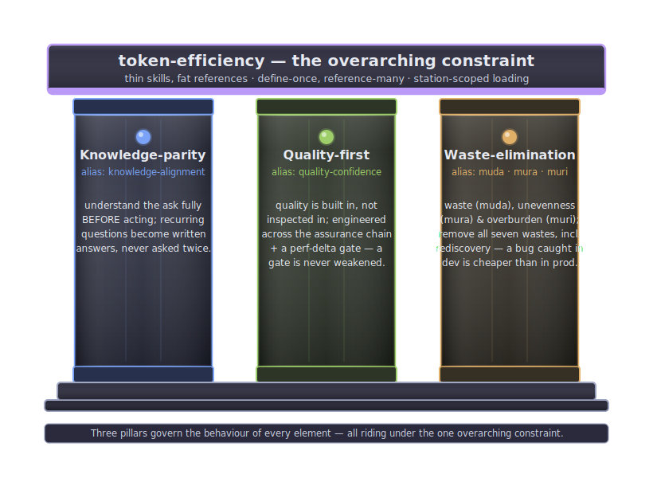
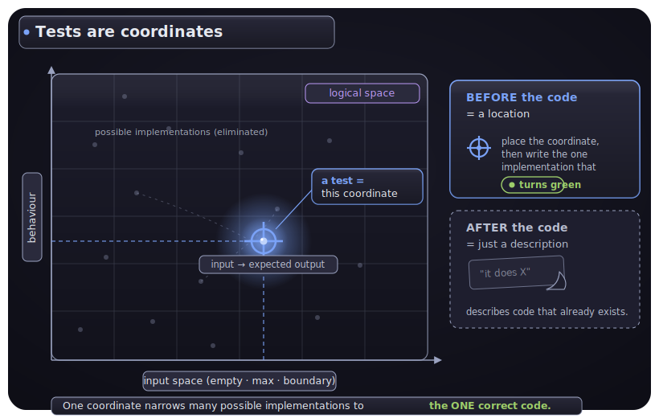
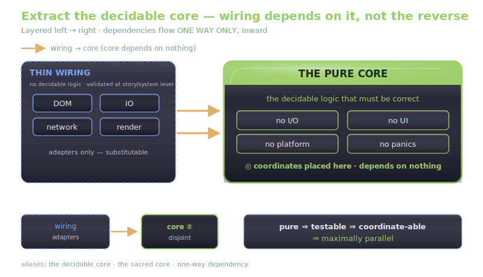
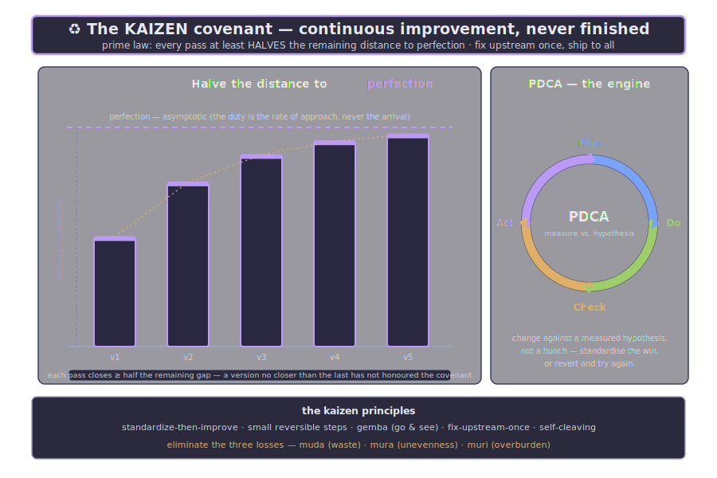
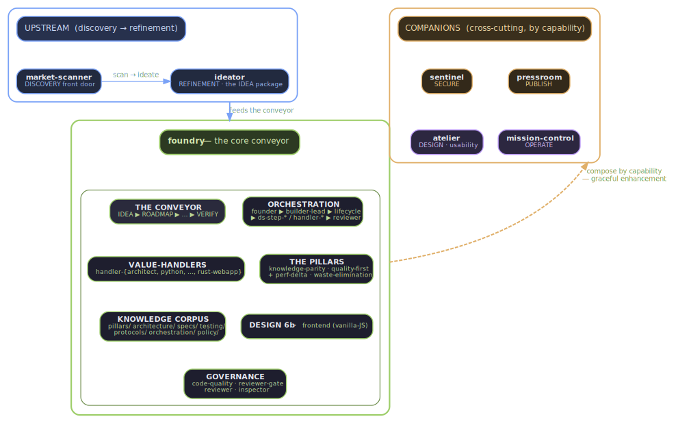

<div align="center">


# idea-to-production

**Carry software from the spark of an IDEA to PRODUCTION** — eight composable Claude Code plugins, one
disciplined, **test-first** value flow: discover ▸ refine ▸ design ▸ build ▸ assure ▸ secure ▸ publish ▸ operate.

</div>

> **Start here →** **`/i2p:help`** browses every power you have · **`/i2p:flow`** shows the pipeline ·
> **`/i2p:review`** gives one verdict from every reviewer. The **i2p** plugin is the front door — it
> also greets whoever opens the repo (the welcome + the status line).
>
> **Already have a product proposition?** → **`/ideator:ideate "By doing X I propose Y, value Z"`**
> starts directly from your thesis (raw-idea mode — it recognises the problem/solution/value triad and
> pre-fills the brief). Not sure the thesis holds? **`/market-scanner:market-scan`** also *validates* a
> held thesis (its thesis-validation mode), not only generates fresh opportunities.

---

## What governs everything — the three pillars

A disciplined, test-first conveyor that carries **VALUE** from **IDEA** to **PRODUCTION**, governed by
**three pillars** under one overarching constraint:

| Pillar | also called | in one line |
|---|---|---|
| 🧭 **Knowledge-parity** | knowledge-alignment | understand the ask **completely before acting** — recurring questions become written answers, asked once. |
| 🛡️ **Quality-first** | quality-confidence | quality is **built in, not inspected in** — every station, strengthened by a performance-delta gate; a gate is never weakened to make progress. |
| ♻️ **Waste-elimination** | muda · mura · muri | remove waste in every form, *including rediscovery* — a bug caught in development is far cheaper than one in production. The three Ms: *muda* (waste), *mura* (unevenness), *muri* (overburden). |

> **Overarching constraint — token-efficiency:** *thin skills, fat references; define once, reference
> many; load only what a station needs.* And the marketplace is **self-improving**: when an element
> learns from a mistake, it folds the fix back into itself — *self-cleaving* into smaller, sharper parts
> where needed — and **raises a PR so every user inherits the improvement**.

---

## ✦ Built on first principles

Not decoration — these are the ideas the whole system obeys. The philosophical spine is
[first-principles.md](plugins/foundry/knowledge/first-principles.md); the operation is
[VALUE_FLOW.md](plugins/foundry/VALUE_FLOW.md).

<div align="center">

### ① Three pillars govern every element



*Knowledge-parity · quality-first · waste-elimination — under one token-efficiency constraint.*

### ② Tests are coordinates, not checks



*A failing test written **before** the code is a **location** in logical space; one written after is just a description.*

### ③ A pure core makes it parallel



*Extract the decidable core; dependencies flow one way, inward. **pure ⇒ testable ⇒ coordinate-able ⇒ maximally parallel.***

### ④ It improves itself — kaizen



*Every pass at least **halves the distance to perfection**; fix upstream once, ship to all.*

### ⑤ Every piece, one map



*Upstream discovery → the foundry conveyor → cross-cutting companions. Eight plugins, one value flow.*

</div>

---

## The plugins

Eight composable plugins span the whole arc — the **i2p** front door (which also greets whoever opens the
repo) and seven specialists. Each stands alone; install only what you need.

| Plugin | What it does | Install when you want… |
|--------|--------------|------------------------|
| **[i2p](plugins/i2p/)** | The marketplace FRONT DOOR / meta-layer + ARRIVAL layer: `/i2p:help` browses every power you have (grouped by the value flow), `/i2p:review` fans out **every installed reviewer** — code, design, docs, security — into one verdict, `/i2p:check` consolidates readiness, `/i2p:flow` maps the pipeline and your next command. It also GREETS whoever opens the repo — a `SessionStart` hook renders a maintainer-authored `.claude/welcome.md` (**smart-gated**: greets only on a cold/vague open, steps aside for a concrete task), `/i2p:define-welcome` reads a repo and writes that welcome for you, and `/i2p:statusline` turns on a rich two-line **status line** (context & rate-limit gauges, the product-lifecycle phase, a ⚔ reviewer-catch tally). Introduces itself on session start. | A single front door to the whole suite — one review that pulls in *all* the reviewers at once, plus a greeting and a status bar that surface the whole suite at a glance. |
| **[market-scanner](plugins/market-scanner/)** | The DISCOVERY front door: set a standing `/discovery-goal`, then `/market-scan` — an adversarially-challenged dialogue over a market parameter taxonomy (demand, willingness-to-pay, pricing power, competition, reachability, stack-fit) that proposes, scores, validates, and **kills weak ideas early**, until one candidate earns a keep verdict. | To find *what's worth building* before writing any code. |
| **[ideator](plugins/ideator/)** | The REFINEMENT phase: turns a validated opportunity (or a raw idea) into the **IDEA package** — precise agent-facing handoff docs (brief + SMU-seed + first slice + handoff contract) plus a rich, illustrated user-facing dossier — refined to knowledge-parity, then handed to foundry. | To turn a spark into a build-ready, unambiguous package. |
| **[foundry](plugins/foundry/)** | The DELIVER + BUILD value conveyor: `/roadmapper` authors the **FLEET v2 pipeline** (`docs/roadmap/` EPIC/PLAN docs — the canonical roadmap, answering "what's on the roadmap" via the external FLEET pipeline plugin) and drives IDEA ▶ ROADMAP ▶ PLAN ▶ EARS ▶ FEATURE ▶ TEST ▶ IMPLEMENT ▶ STORY ▶ SHIP, staffed by role-tuned agents and governed by three pillars (knowledge parity, quality-first + perf-delta gate, waste elimination). The external **FLEET continuous-delivery engine** drains that pipeline, invoking FOUNDRY's PLAN-scope build per slice. | A disciplined, test-first, vertical-slice production system whose roadmap is a continuously-delivered pipeline. |
| **[security](plugins/security/)** | A pre-release security gate: PII, secrets/credentials, and dependency/supply-chain audits → one severity-ranked report with a PASS / REVIEW / BLOCK verdict. | To never ship a leaked key, a real person's data, or a vulnerable dependency. |
| **[publish](plugins/publish/)** | Publishing: narrative articles mined from git history & docs, standalone diagrams (Graphviz/Mermaid), and print-quality PDFs with A4-legible figures. | Documentation and release artefacts that look professionally published. |
| **[atelier](plugins/atelier/)** | The DESIGN studio: `/ui-review` crawls any SPA's routes (screenshot + accessibility snapshot) and writes a **scored, prioritised** critique citing named canon (Gestalt, the UX laws, Nielsen's heuristics, WCAG 2.2); `/mockup` composes polished screens and flows and runs a **convergent** designer↔reviewer loop until they clear a design-fitness rubric. | Visual work — UIs, mockups, user-flows — that is *artistic, elegant, and accessible*, not first-draft. |
| **[operate](plugins/operate/)** | The OPERATE phase: keep the live product healthy and feed the next cycle — `/operate-gate` runs go-live + steady-state readiness, `/observability` instruments the four golden signals and SLI→SLO→alerts, `/incident` drives severity-tiered response → runbook + blameless postmortem, `/maintain` keeps dependencies/CVEs/certs current, and `/iterate` turns a production signal into a new OPPORTUNITY that re-enters DISCOVER (↻). | To run what you shipped — observe it, respond to incidents, maintain it, and loop its learnings back to discovery. |

## How they compose

The plugins form a **nine-phase cycle** — `DISCOVER ▸ IDEATE ▸ DELIVER ▸ DESIGN ▸ BUILD ⇄ ASSURE ⇄ SECURE ▸
PUBLISH ▸ OPERATE ↻` — whose learnings loop back to discovery (the masthead above). **DELIVER** (between
IDEATE and DESIGN) turns the IDEA package into a dependency-ordered roadmap. The three realisation phases
**BUILD ⇄ ASSURE ⇄ SECURE** form a **loop** — a failed quality or security gate re-enters BUILD; the loop
exits to PUBLISH only when all three are satisfied. **ASSURE** (quality) and **SECURE** (security) are
deliberately **separate first-class gates**.

**The next command at each phase:**

| Phase | Plugin | Next command |
|---|---|---|
| **DISCOVER** | market-scanner | `/discovery-goal` · `/market-scan` → a kept OPPORTUNITY |
| **IDEATE** | ideator | refine → the **IDEA package** (agent + user-facing faces) |
| **DELIVER** | `foundry:roadmapper` (+ external FLEET engine) | `/roadmapper` authors the v2 `docs/roadmap/` pipeline; the FLEET engine drains it |
| **DESIGN** | atelier | `/mockup` · `/ui-review` |
| **BUILD** | foundry | IDEA ▶ ROADMAP ▶ … ▶ STORY ▶ SHIP *(loop entry)* |
| **ASSURE** | foundry | `/pr-review` (quality V&V) *(fail → BUILD)* |
| **SECURE** | security | `/scan-all` → SECURITY-REPORT.md *(fail → BUILD; pass → PUBLISH)* |
| **PUBLISH** | publish | `/publish` — articles & PDFs |
| **OPERATE** | operate | observe · `/incident` · `/iterate` |

**Three concerns cross-cut every phase:**

| Concern | Owner | How |
|---|---|---|
| **Usability** | atelier (DESIGN) | `/ui-review` · `/mockup` — the convergent designer↔reviewer loop |
| **Quality** | foundry (ASSURE) | built-in, not inspected-in; certified at the ASSURE gate |
| **Security** | security (SECURE) | baked in from the start; certified at the SECURE gate |

**No plugin requires another — they light each other up *by capability* (graceful enhancement):**

| When installed | The pipeline gains… | Fallback when absent |
|---|---|---|
| **ideator** | foundry's IDEA station receives the IDEA package | the inline `ideator` skill |
| **security** | the SECURE gate runs before delivery | stage skipped, and says so |
| **publish** | PUBLISH upgrades markdown → articles, diagrams, PDFs | markdown as-is |
| **atelier** | user-flows & mockups are design-reviewed before anyone sees them | stage skipped, and says so |

And the loop closes: an ambiguity a builder hits downstream flows back as **ideation-feedback** that
sharpens market-scanner / ideator for every future idea.

## Install

Add the marketplace, then install whichever plugins you want:

```
/plugin marketplace add whatbirdisthat/idea-to-production
/plugin install i2p@idea-to-production
/plugin install market-scanner@idea-to-production
/plugin install ideator@idea-to-production
/plugin install foundry@idea-to-production
/plugin install security@idea-to-production
/plugin install publish@idea-to-production
/plugin install atelier@idea-to-production
/plugin install operate@idea-to-production
```

Each plugin works on its own — `market-scanner` and `ideator` need no build system to help you find and
shape an idea, and `security` and `publish` are useful on any repository, not just foundry projects.

### "What's on the roadmap" — the FLEET v2 pipeline

The roadmap **is** the FLEET continuous-delivery pipeline, authored by **`/roadmapper`** into
`docs/roadmap/` as `EPIC_NNNN.md`/`PLAN_NNNN.md` docs. **For this repo, state + schedule live on the org
GitHub Project (v2) board** (board mode); the local `.pipeline.md` manifest has been retired. To read it:

- If the external **FLEET `pipeline` plugin** is installed (a separate marketplace, like `token-fairness`),
  answer from its deterministic surface — **`/pipeline:status`** (or `pipeline-cron.sh status`/`next`) —
  authoritative and ~0 LLM tokens.
- Otherwise: this repo is **board mode** — read state from the **GitHub Project board** (the
  `EPIC_NNNN.md`/`PLAN_NNNN.md` docs are the build instructions, not the state). *(A `local_file`-mode
  project instead parses `docs/roadmap/.pipeline.md` structurally — `order | epic | state | constructs |
  branch` — plus each `EPIC_NNNN.md`'s `## Plans` table `order | plan | state`.)*

To **build**, the FLEET engine drains the pipeline continuously (`/pipeline:run`,
`/pipeline:unattended`); a single item is a GO kick-off via `/roadmapper` (which the engine builds
through FOUNDRY's PLAN-scope entry). *(The legacy in-repo `flow` plugin and its `flow-mcp` server have
been retired — the FLEET engine supersedes them.)*

## Concepts & glossary

New here? [`plugins/foundry/knowledge/glossary.md`](plugins/foundry/knowledge/glossary.md) names every
concept, plugin, agent, skill, and command, draws the conceptual-domain tree, and settles the
**foundry vs forge vs founder** question. The system itself is described in
[`plugins/foundry/VALUE_FLOW.md`](plugins/foundry/VALUE_FLOW.md). For a phase-by-phase catalog of
every slash command across all eight plugins, see [`docs/SLASH_COMMANDS.md`](docs/SLASH_COMMANDS.md).

## License

Dual-licensed under **MIT OR Apache-2.0**. See [LICENSE](LICENSE).
