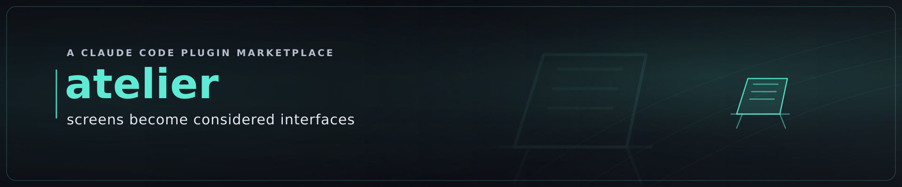

# ATELIER — Design studio & adversarial UI review

> The designer's workshop of the marketplace — where visual work is both **made** and **critiqued** to a
> commercial-grade standard. *Artistic, elegant, powerful, excellent.*

![The designer↔reviewer critique loop animated: a rough wireframe screen on the left is reviewed by an amber scan sweep while a five-criterion design-fitness rubric on the right (Visual hierarchy, Contrast / WCAG AA, Touch targets · Fitts, Consistency · Jakob, Delight · Norman) resolves left-to-right — each finding flags amber, then clears to a teal check as its score bar fills; across three iterations the screen refines from dim greys to teal-accented and accessible, until the bottom design-fitness gate strip turns green (PASS — no HIGH findings · WCAG AA clear · score ≥ target) with a teal check badge on the screen, and the settled loop closes.](../../doc/images/atelier-critique.gif)

ATELIER is the **DESIGN** capability of the `idea-to-production` marketplace. It does two things, joined by
one loop:

- **`/ui-review`** — an adversarial, SOTA-grounded **design critic**. Point it at any running SPA: it
  crawls the navigable routes, screenshots and reads the **accessibility tree** of each, and writes a
  **scored, prioritised** critique where every finding cites a *named* principle. Or paste a screenshot for
  an instant ad-hoc opinion.
- **`/mockup`** — a **design generator**. It composes polished screens, wireframes, and user-flows to the
  canon and runs them through the reviewer until they clear the fitness rubric — so the output is
  *carefully composed, not first-draft*.

## What makes the reviewer heavyweight

Not harshness — **grounding**. ATELIER carries the named design canon and cites it in every finding:

- **Screen & interaction:** Gestalt principles · visual hierarchy · the UX laws (Fitts · Hick · Miller ·
  Jakob) · **Nielsen's 10 heuristics** · **Norman's emotional design** (the path to *delight*).
- **Accessibility:** **WCAG 2.2 AA** as a non-negotiable floor — and the judgment to catch the ~50%+ that
  automated tools miss.
- **Colour, type, grid:** disciplined palettes, modular type scales, the 8-pt grid.

The full canon lives in [`knowledge/canon/`](knowledge/canon/README.md).

## The loop that actually improves (not ping-pong)

ATELIER's designer↔reviewer loop is **bounded and measurable**
([`knowledge/protocols/design-critique-loop.md`](knowledge/protocols/design-critique-loop.md)): the
reviewer scores the artefact on a **design-fitness rubric** and returns prioritised fixes; the designer
applies them and re-renders; the loop **stops** when it converges (no HIGH findings, accessibility gate
clear, score ≥ target), or when improvement stalls (it surfaces the impasse and asks — it does *not* take
another wasteful lap). Every turn must measurably improve or the loop halts.

## How it composes

- **ATELIER ↔ foundry** — foundry's `frontend` design-system owns the *source-level* contract (`@front-end`
  INTENT markers, `definition-of-good`, the build-time `design-critic`). ATELIER reviews the **rendered
  experience** of any app and carries the deeper canon; it reads those markers **by capability** when
  foundry is present and *extends* them — never duplicates. Standalone, it works on any repo.
- **ATELIER → pressroom** — user-flows and chart-style figures are rendered via pressroom's `/publish`
  **by capability**; absent, ATELIER emits Mermaid/markdown source and says so.
- **IDEATOR → ATELIER** — when IDEATOR builds an IDEA dossier's user-flows and mockup screens, it calls
  ATELIER **by capability** so the user sees design-reviewed material, not first drafts.
- The arc: **DISCOVER → IDEATE → BUILD → SECURE / PUBLISH**, with **DESIGN (atelier)** a cross-cutting
  visual capability. *Graceful enhancement* — no hard dependency in any direction.

## Governed by the marketplace covenant

ATELIER holds the **three pillars** (knowledge-parity, quality-first, waste-elimination) under the
**token-efficiency** constraint, and the **SOLID self-improvement covenant**
([`knowledge/covenant.md`](knowledge/covenant.md)) — when a shipped design proves weak in a way a review
missed, the canon or the rubric is **sharpened via a PR**, so every future review, for all users, catches
it by default.

Ships a **Playwright MCP** ([`.mcp.json`](.mcp.json)) for live crawl/screenshot/accessibility-snapshot.
Verify your tools with **`/atelier:check`**. Dual-licensed **MIT OR Apache-2.0**.
