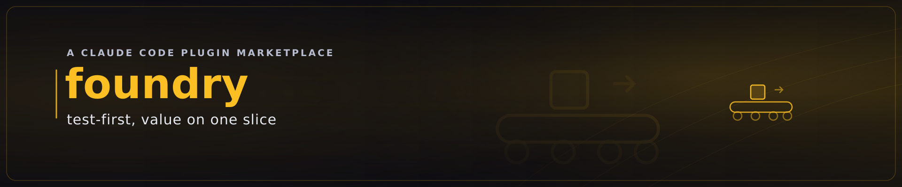

# foundry — the value-flow production system

`foundry` is the core plugin of the [idea-to-production](../../README.md) marketplace: a **conveyor
that carries value from IDEA to PRODUCTION**, one vertical slice at a time, through a fixed line of
**value-stations** staffed by role-tuned **value-handlers**, governed by three pillars and a
performance-instrumented **test contract**. Read [`VALUE_FLOW.md`](VALUE_FLOW.md) for the system and
[`knowledge/glossary.md`](knowledge/glossary.md) for every name + the conceptual map (including the
**foundry vs forge vs founder** distinction).

![The test-first value conveyor: an IDEA token rides a fixed line of value-stations — IDEA ▸ EARS ▸ TESTS ▸ IMPL ▸ GREEN ▸ SHIP — each gate latching green as it clears. The motion teaches the red→green spine: when the token reaches the TESTS gate it lights RED first (a failing test written before any code exists), and only once the token advances to IMPL does the TESTS gate flip red ▸ green — proof comes first, then code turns the failing proof green. The token then rides on through GREEN to SHIP, the full line latched teal with check-marks, and holds as a settled poster.](../../doc/images/foundry-conveyor.gif)

## What's inside

| Area | What it holds |
|---|---|
| [`VALUE_FLOW.md`](VALUE_FLOW.md) | The spine: the stations, the pillars, tests-as-coordinates. Start here. |
| [`agents/`](agents/) | The orchestration hierarchy + the value-handlers + governance (see below). |
| [`skills/`](skills/) | The station skills (`ideator`, `roadmapper`, `development-system-core`, `lifecycle-states`, `code-quality`, `reviewer-gate`, `frontend`, `vertical-slice`, `founder-method`, `value-station-handoff`, `handoff-protocol`, `builder`, `phase-sensor`, and the Rust one-shot [`rust-webapp-rollout`](skills/rust-webapp-rollout/)). |
| [`knowledge/`](knowledge/) | The define-once canon (pillars, architecture, specs, testing, protocols, orchestration, policy). Index: [`knowledge/README.md`](knowledge/README.md). |
| [`commands/`](commands/) | `/foundry`, `/inspect`, `/coverage-loop`, `/phase-sensor`, `/rust-webapp-rollout`. |
| [`hooks/hooks.json`](hooks/hooks.json) | A PostToolUse hook that runs the `phase-sensor` so the dev-system self-applies. |
| [`examples/`](examples/) | Worked dev-system artefacts (real EARS → Gherkin → plan). Index: [`examples/README.md`](examples/README.md). |
| [`docs/`](docs/) | [`MIGRATION.md`](docs/MIGRATION.md) (provenance) + [`DEPRECATED.md`](docs/DEPRECATED.md) + [`HISTORY.md`](docs/HISTORY.md) (origin story). |

## The orchestration hierarchy (three altitudes, one chain of command)

(The `inspector` agent audits the plugin itself, off the production chain of command.)

**Value-handlers:** [`handler-architect`](agents/handler-architect.md), `-python`, `-fastapi`,
`-js`, [`-vanilla-js`](agents/handler-vanilla-js.md) (native handler of the `frontend` DESIGN
system), `-react`, `-css`, `-playwright`, [`-rust`](agents/handler-rust.md), and
[`-rust-webapp`](agents/handler-rust-webapp.md) (the RUST_WEBAPP_API one-shot, governed by the
[`rust-webapp-rollout`](skills/rust-webapp-rollout/SKILL.md) skill).

## The test contract (why FOUNDER may refuse to build)
Five levels — **unit, module, boundary, system, STORY** — each emitting performance samples, with a
**gated perf-delta** alongside the STORY tests. 100% line+branch coverage is the **floor** (the
consequence of pinning every behaviour); the real variable is **coverage density** — happy / unhappy
/ abuse per behaviour are table-stakes ([`knowledge/testing/test-policy.md`](knowledge/testing/test-policy.md)).
If the contract cannot be satisfied, FOUNDER halts with `CONTRACT UNMET` — the system owner's hard line.

## Using it
Invoke the agent: *"founder, plan this"* / *"explain what we're doing"* / *"expand the top-3"*, or run
`/foundry`. FOUNDER runs discovery (`foundry -help`, `frontend -help`), emits a topology READOUT, then
asks which mode you want. To audit the plugin's own health, say *"inspect FOUNDRY"* (`/inspect`).

To document the external software the installed plugins need — and stamp this machine's ✓/✗ status —
run `/foundry:prerequisites`. Add `--fix` (`/foundry:prerequisites --fix`) to *also* dispatch the
safe, idempotent, **self-verifying** sub-heals before re-stamping: a **thin dispatcher** (not a fat
omni-repair) that calls each plugin's own already-shipped heal — today `scripts/ensure-browser.sh
--fix` for browser/env wiring — then re-runs the per-plugin checks so the document reflects the
post-heal state. Only heals that verify their own result run automatically; anything destructive or
ambiguous (e.g. a canonical-copy re-sync) is **reported, never auto-run** — the human-gated stance.
Without `--fix`, behaviour is unchanged (pure generate-and-stamp).

## Companion plugins (optional — graceful enhancement)
foundry's value artefact is **markdown**. Two cross-cutting concerns live in separate plugins in
the same marketplace and are used *automatically if installed*, with clean degradation if not:

- **SECURITY → [`sentinel`](../sentinel/)** — a pre-release gate (PII, secrets, dependency audit).
  When installed, foundry's release path can run `/security-gate` before DELIVERY; when absent,
  the gate is skipped with a noted recommendation.
- **PUBLISHING → [`pressroom`](../pressroom/)** — articles, standalone diagrams, and
  print-quality PDFs. When installed, foundry can hand markdown to `/publish` for richer output;
  when absent, foundry delivers markdown as-is.

These are referenced **by capability**, never by hard `${CLAUDE_PLUGIN_ROOT}` path across the
plugin boundary. See [`VALUE_FLOW.md §4`](VALUE_FLOW.md). (`frontend`/DESIGN remains *inside* foundry
— it is an on-line station, not a cross-cutting companion.)

## ♻️ Self-improvement covenant — halve the distance to perfection

Every component of this marketplace — every plugin, skill, agent, command, and knowledge doc —
carries the KAIZEN self-improvement covenant: it continuously asks how it can improve and each
iteration must **at least halve the remaining distance to perfection** — eliminating waste
aggressively, holding quality-first absolutely, deepening knowledge-parity with the user, and
fixing recurring gaps *upstream, once* so no future build pays for them again. Canonical text:
[`knowledge/architecture/kaizen-covenant.md`](knowledge/architecture/kaizen-covenant.md).
