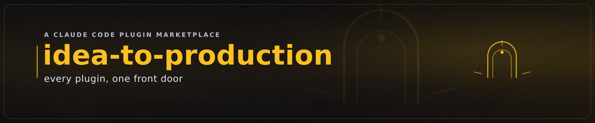

# i2p — the idea-to-production front door

> The marketplace-level front door. Install the suite and you gain great powers across seven specialist
> plugins — **i2p** is the plugin that tells you so, and hands you one verbatim place to drive them all.

The other eight plugins each stand alone and namespace their commands (`/foundry:*`, `/atelier:*`, …).
What the marketplace lacked was a **meta surface**: somewhere to ask "what can I do now?" and a single
review that pulls in *every* reviewer at once. That is i2p.

## Commands

| Command | What it does |
|---|---|
| **`/i2p-help`** | Browse the whole marketplace's powers, grouped by the value flow (DISCOVER ▸ IDEATE ▸ DESIGN ▸ BUILD ▸ ASSURE ▸ SECURE ▸ PUBLISH ▸ OPERATE ↻). Lists only the plugins currently installed, with their key commands and the next thing to run. |
| **`/i2p-review`** | A cross-plugin **adversarial review**. Determines scope, fans out *every installed* specialist reviewer — code (foundry `/pr-review`), design (atelier `/ui-review`), rendered docs (pressroom design-review), security (sentinel `/security-gate`) — adversarially verifies the serious findings, and returns **one** verdict (BLOCK > NEEDS_REVISION > PASS) in `I2P_REVIEW.md`, naming what it could **not** review. |
| **`/i2p-check`** | Run every installed plugin's `/check` and consolidate the ✓/✗ readiness into one table. |
| **`/i2p-flow`** | Show where each installed plugin sits in the value flow and the next command at each stage (Mermaid when pressroom/atelier are present, else markdown). |

## How it composes

i2p is a **thin orchestrator**. It owns no review logic, no dependency checks, no diagram engine of its
own — it **delegates by capability** to the seven specialist plugins and degrades cleanly when any are
absent (reporting the gap, never faking coverage). This is the marketplace's "each plugin lights up the
others when present" pattern, applied at the top level.

## Onboarding

Because Claude Code has no built-in "tips" feature, i2p uses the supported hook mechanisms:

- a **SessionStart** hook that introduces the marketplace once per session (`💡 type /i2p-help …`);
- a **UserPromptSubmit** hook that surfaces a rotating ≤25-word "did you know?" tip every few prompts
  (state-tracked, so it appears *now and then*, not on every turn).

Both degrade silently if anything goes wrong — they never block a prompt.

## Philosophy

i2p carries the marketplace's three pillars and the KAIZEN self-improvement covenant
([`knowledge/covenant.md`](knowledge/covenant.md)). When a user can't find a power they have, the fix is
upstream — a sharper `/i2p-help` line or a new tip, landed via PR so every future session inherits it.

Dual-licensed under **MIT OR Apache-2.0**.
