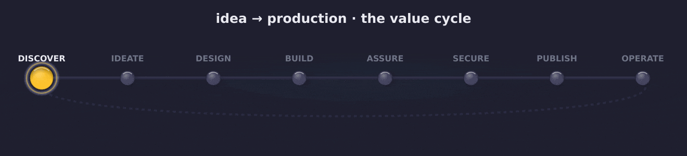

# The idea-to-production product lifecycle

> The organising spine of the marketplace. Every plugin is a **phase** or a **cross-cutting concern** of one
> lifecycle that carries a product from **the search for an idea** to **IN PRODUCTION** — realised, live, and
> operated. This document is the canonical articulation; the statusline phase widget, `/i2p-help`, and
> `/i2p-lifecycle` all read it.

## What "product lifecycle" means here

The academic literature uses *two distinct* "product life cycles", and conflating them causes drift:

- **The market life cycle** (marketing): *introduction → growth → maturity → decline.* This is the
  product's life **in the market** — how it sells over time.
- **The creation arc** (engineering PLM + New Product Development): *Fuzzy Front End → development →
  commercialization → **operation**.* This is how the product is **brought into being and kept alive**.

**idea-to-production is the creation arc, carried through into operation.** It begins in the **Fuzzy Front
End** — "the search for an idea" — runs through **commercialization / realization** (the idea is **IN
PRODUCTION** — realised & live), and does not stop there: it includes **OPERATE**, the living phase where the
product is monitored, kept healthy, and iterated. The market life cycle runs *alongside* OPERATE, and OPERATE's
learnings **loop back to DISCOVER** to open the next value cycle. The lifecycle is therefore a **cycle, not a
dead-end**.

> Vocabulary note: in manufacturing PLM, "production" means *making units*; in idea-to-production,
> **IN PRODUCTION** means *realised and operating* — the software/operational sense, matching the NPD
> "commercialization" endpoint and extending into the PLM **service/operate** stage. We keep the
> idea-to-production philosophy and **annotate** it with the state-of-the-art frames below; we do not migrate
> to any single school.

## Two kinds of lifecycle element

A product is not built by phases alone. Some value is added **once, in sequence** (you discover, then ideate,
then build); other value must be **present from the first moment and woven through every phase** (a product is
not "made usable" or "made secure" at one station — those are properties built in from the start and *certified*
at a gate). So the lifecycle has two kinds of element:

1. **Phases** — the linear value-creation spine. Each transforms the product and has one primary owner.
2. **Cross-cutting concerns** — first-class properties present from the beginning, woven through every phase,
   each owned by one plugin and **certified at a dedicated gate**. There are three: **usability**, **quality**,
   and **security**.

This is why `DESIGN`, `ASSURE`, and `SECURE` are *both* listed as phases (their certifying gate) *and* called
out as cross-cutting — they begin long before their gate and never really stop.

## The phases

The lifecycle is **eight working phases** that form a cycle, each owned by one plugin and grounded in the named
canon. (State-file token in brackets — see `skills/lifecycle/`.)

| # | Phase `[token]` | Owner | Value added | Canon lineage |
|---|---|---|---|---|
| ① | **DISCOVER** `[DISCOVER]` | market-scanner | find a problem worth solving; kill weak ideas early | Fuzzy Front End (opportunity identification) · Double Diamond **Discover** (diverge: problem) |
| ② | **IDEATE** `[IDEATE]` | ideator | turn the opportunity into a build-ready IDEA package at knowledge-parity | Double Diamond **Define** (converge: concept) · NPD concept development · design-thinking *empathize/define* |
| ③ | **DESIGN** `[DESIGN]` | atelier | make the experience usable, elegant, accessible | Double Diamond **Develop** (diverge: solution) · design thinking *ideate/prototype* |
| ④ | **BUILD** `[BUILD]` | foundry | realise it test-first through the value conveyor (IDEA▶…▶SHIP) | Double Diamond **Deliver** · NPD development · PLM **Realize** |
| ⑤ | **ASSURE** `[ASSURE]` | foundry | **certify quality** — adversarial V&V: tests green, coverage density, perf-delta, regression, architecture | Verification & Validation · quality gate (PDCA *check* / DMAIC *control*) |
| ⑥ | **SECURE** `[SECURE]` | security | **certify security** — PII, secrets, supply-chain clear before exposure | secure-by-design · supply-chain integrity · the security gate |
| ⑦ | **PUBLISH** `[PUBLISH]` | pressroom | announce & document it for its audience | commercialization / launch communication |
| ⑧ | **OPERATE** `[OPERATE]` | mission-control | keep it alive & improving: observe, respond to incidents, iterate, maintain | PLM **service/operate** · SRE · the market life cycle (introduction→growth) · DMAIC *control* in production |
| ↻ | *(re-entry)* | market-scanner | OPERATE's learnings open the **next** value cycle | continuous discovery · build-measure-learn |

**ASSURE and SECURE are separate — deliberately.** Quality and security are *different* concerns and must not
be conflated under one gate. **Quality** (ASSURE) asks *"is it correct, tested, performant, regression-free?"*;
**security** (SECURE) asks *"is it safe to expose — no leaked secrets, no PII, no vulnerable deps, no exploitable
code?"* A product can be high-quality and insecure, or secure and broken. Each gets its own owner, its own
verdict, and its own gate.

## The three cross-cutting concerns

Woven through *every* phase from the start, each certified at the gate named above:

- **Usability (DESIGN, atelier)** — present from IDEATE (you shape the experience as you define the concept);
  atelier also reviews surfaces produced during BUILD. Certified at the **DESIGN** gate (design-fitness rubric).
- **Quality (ASSURE, foundry)** — *first-class, built-in not inspected-in.* The test-first conveyor means
  quality is engineered from the first line of BUILD (indeed from the EARS spec); the **ASSURE** gate is where
  foundry's adversarial reviewer panel *certifies* it. Quality is a pillar of the whole suite, not a late check.
- **Security (SECURE, security)** — *baked in from the beginning.* Secure-by-design starts at DISCOVER
  (don't pursue opportunities you can't operate safely) and IDEATE (threat-model the concept); the **SECURE**
  gate is security's pre-exposure certification. Security is never bolted on at the end.

## Binding the domain — five lenses on one arc

idea-to-production deliberately speaks five vocabularies at once, because a product is all of them:

- **product / engineering** — PLM conceive→design→realize→**operate**; the conveyor, its gates, and the
  living-product loop (BUILD, ASSURE, OPERATE).
- **manufacture** — "realize / make"; the test-first conveyor is the production line (BUILD).
- **artistic expression** — conception → study → composition → critique → exhibition; the designer↔reviewer
  loop and the publishing craft (DESIGN, PUBLISH).
- **commerce** — opportunity → willingness-to-pay → go-to-market → growth; the front end, launch, and operate
  (DISCOVER, PUBLISH, OPERATE).
- **quality & safety** — built-in not inspected-in; PDCA/DMAIC; the adversarial quality gate and the security
  gate as two distinct first-class concerns (ASSURE, SECURE, and the quality pillar throughout).

## Entry / exit signals

A phase is *entered* when its predecessor's exit signal fires, and *exited* when its artifact exists:

- DISCOVER → IDEATE: a **kept OPPORTUNITY** (market-scan verdict, upheld by the independent challenger).
- IDEATE → DESIGN: a **handoff-contract-complete IDEA package** (foundry discovery exit criteria; READY from the
  independent challenger).
- DESIGN → BUILD: design-reviewed surfaces clear the **design-fitness rubric** (when UI is in scope).
- BUILD → ASSURE: the conveyor reaches **SHIP** (implementation in, tests green, story proven).
- ASSURE → SECURE: foundry's adversarial **quality review PASSES** (`/pr-review` / reviewer panel).
- SECURE → PUBLISH: security's **scan-all PASSES**.
- PUBLISH → OPERATE: the release artefacts are out; the idea is **realised & live**.
- OPERATE → DISCOVER (↻): an operate learning (a metric, an incident, a feedback signal) becomes a **new
  opportunity** — the next cycle begins.

## How the marketplace aligns to this spine

- The **state file** `.i2p/lifecycle.json` records `current_phase`. Each owning plugin **advances it at its own
  exit signal** by calling `/i2p-lifecycle done <its-phase>` (by capability — only when i2p is installed).
  `done` is **order-safe & idempotent**: it advances *only if* the lifecycle is at that phase, so a plugin can
  never jump it out of order or auto-start it. Helper: `skills/lifecycle/scripts/lifecycle.sh`
  (`init|get|status|done|set|advance`).
- The **statusline** phase widget (shipped by `concierge`) reads it and shows `◆ lifecycle … (n/8)`.
- **Token cost is tracked per phase** with a self-calibrating estimator — see
  [`instrumentation.md`](instrumentation.md). `/i2p-lifecycle init` seeds estimates; each phase's
  actual-vs-estimate is measured (concierge Stop hook) and folded back so estimates improve over time.
  The HUD shows `◇ session` spend and `◈ life actual/~estimate (Δ%) · $`.
- **`/i2p-help`** explains this lifecycle and offers to **kick one off**; **`/i2p-lifecycle`** initialises
  and reports it.
- This doc is referenced by `foundry/VALUE_FLOW.md` and the glossary so the whole suite shares one spine.

> **Graceful degradation.** An owner plugin may be absent (e.g. `mission-control` for OPERATE). The lifecycle
> still advances by hand (`done`/`advance`), and surfaces say what installing the owner would unlock — a gap is
> named, never silently skipped.

> Self-improvement covenant: if a phase, owner, concern, or lineage here drifts from how the plugins actually
> behave, fix it **here once** — every surface that renders the lifecycle inherits the correction.
