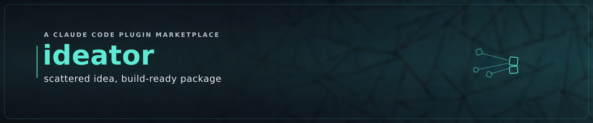

# IDEATE — Refine an idea into a build-ready IDEA package

> The bridge from *a candidate worth pursuing* to *a thing the conveyor can build*.

IDEATE is the **REFINEMENT** phase of the `idea-to-production` marketplace. It takes a validated
opportunity (from [`discover`](../discover/)) or a raw idea you already have, refines it to
**knowledge-parity** through an adversarially-challenged dialogue, and emits the **IDEA package**.

![IDEATE animated: four scattered fragments — PROBLEM (the pain, sharp), USERS (named actors), CRITERIA (testable success), and SCOPE (explicit edges) — drift in from the corners and dock one-by-one into a central IDEA-package frame, each turning from dim to amber in-flight to teal as it locks and the knowledge-parity meter fills; once all four axes are locked the challenger's READY stamp lands amber and settles teal, captioned "challenger signs off · knowledge-parity reached → hand off to DELIVER". The motion teaches IDEATE: a scattered idea is refined axis-by-axis to knowledge-parity until the package is unambiguous and signed off.](../../docs/images/ideate-converge.gif)

## The IDEA package — two faces, one understanding

- **Agent-facing** (precise, high-clarity, for the conveyor): an **idea brief**, an **SMU-seed**, the
  **first vertical slice**, and a **handoff contract** — that satisfies DELIVER's **discovery exit
  criteria** (actionable problem, named actors, explicit scope, concrete constraints, testable success).
  This is what DELIVER ingests; it must be unambiguous to a fresh agent with no history.
- **User-facing** (rich, illustrated): the **IDEA dossier** — opportunity narrative, parameter scorecard,
  market/pricing/competition charts, a **user-flow**, and (for a UI idea) a **mockup screen** — rendered
  **by capability**: charts via [`publish`](../publish/)'s `/publish`, and flows/mockups via
  [`design`](../design/)'s `/mockup` (designed to the canon and **design-reviewed** before you see them —
  carefully composed, not first-draft). Degrades to structured markdown / Mermaid-source otherwise.

The two faces never disagree: a fact corrected in one is corrected in both. The package is **iterated with
you** until both are right, *then* handed off.

![The IDEA package has two faces from one shared understanding (knowledge-parity, the shared spine): the agent-facing face (precise, for the conveyor) carries the idea brief, SMU-seed, first vertical slice, and handoff contract that satisfy DELIVER's discovery exit criteria; the user-facing face (rich, illustrated) carries the opportunity narrative, parameter scorecard, market/pricing/competition charts, and a user-flow / mockup screen — the same facts shown to a human. The two stay in sync: a fact corrected in one face is corrected in both.](diagrams/01-idea-package-faces.png)

## Naming a product

Need a name? **`/ideate:name`** (the `name-search` skill) runs a marketing-grade **naming studio**:

1. **Discovery interview** — infer-first, then asks only the load-bearing gaps (audience, **brand
   archetype**, **name-type appetite**, power-adjacency, intellectual-humour appetite, risk appetite),
   one question at a time with a recommended answer + multiple choice.
2. **Wide-net generation** — not just coined words: the full **name-type taxonomy** (suggestive, metaphor,
   mythological, compound, portmanteau, coined, acronym/**backronym**, scientific-taxonomic, animal, …)
   layered with language/etymology veins, **affix hooks** (-ify, -ly, get-, …), and **phonosemantic**
   tuning to the archetype. The art-of-naming canon lives in [`knowledge/naming/`](knowledge/naming/).
3. **Deterministic verification** (zero per-name LLM tokens) — npm / PyPI / crates.io / GitHub with an
   adoption tier (CLEAR / LOW_ADOPTION / ABANDONED / TAKEN), plus opt-in **neighbour / typo-squat
   proximity** (no accidental visits), **domain availability** (RDAP: .com/.dev/.io/.ai), and a
   **cross-language connotation** screen.
4. **Scored challenge** — Neumeier's 7 criteria, Watkins' SMILE/SCRATCH, archetype-fit, sound-symbolism-fit
   — availability and challenge kept as separate verdicts.
5. **Ranked report** — where it searched, every name kept/rejected and why, the rubric scores, a top pick
   with confidence + residual risks. Use it to name a new product, an org, or to rename one.

> Tip: set `GITHUB_TOKEN` for a reliable neighbour pass (the GitHub search API is rate-limited; without a
> token, neighbour status is reported `unknown`, never guessed).

Where the challenge turns on a fact about the world — comparable **pricing**, whether an incumbent owns
the **wedge**, the current **stack** reality — IDEATE validates against **web research** (built-in
WebSearch/WebFetch + a shipped, keyless Fetch MCP) before writing the answer into the package; what it
can't verify is recorded as an open question, not a guess. (Reuses discover's evidence when handed one.)

## How it composes

- **discover → IDEATE**: a kept opportunity is refined here. Or bring your own raw idea — IDEATE
  starts the dialogue from scratch.
- **IDEATE → deliver**: the agent-facing package is handed to [`deliver`](../deliver/)'s IDEA station
  (by capability) → roadmap → `/loop /deliver` carries it to PRODUCTION. **IDEATE supersedes DELIVER's
  inline ideate**, which remains as the graceful-degradation fallback when this plugin is absent.
- The arc: **DISCOVER (discover) → IDEATE (ideate) → BUILD (deliver) → SECURE/PUBLISH
  (secure/publish)**. *Graceful enhancement* — no hard dependency in any direction.

## The feedback loop

When a downstream builder hits an ambiguity the IDEA package *should* have resolved, that feedback flows
back: the corresponding challenge axis or package field is **sharpened via a PR**, so every future
ideation, for all users, asks the missing question by default. The spark gets sharper over time.

## Governed by the marketplace covenant

IDEATE holds the **three pillars** (knowledge-parity, quality-first, waste-elimination) under the
**token-efficiency** constraint, and the **KAIZEN self-improvement covenant**
([`knowledge/covenant.md`](knowledge/covenant.md)). Refinement to knowledge-parity *is* its whole job.

**Commands:** `/ideate` (refine an idea), **`/ideate:name`** (name a product), **`/ideate:inspect`**
(audit this plugin), `/ideate:self-improve` (sharpen it), `/ideate:check` (verify tools). Dual-licensed
**MIT OR Apache-2.0**.
