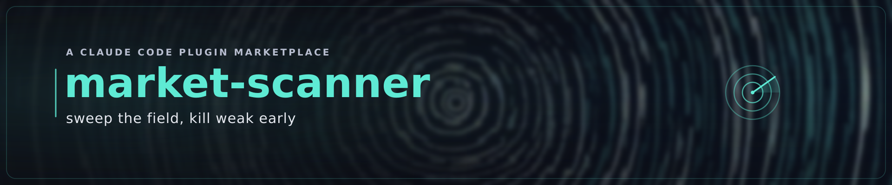

# MARKET-SCANNER — Discover what's worth building

> *"Let's come up with a new idea."* — the spark, made disciplined.

MARKET-SCANNER is the **DISCOVERY** front door of the `idea-to-production` marketplace. Before any code
exists, it helps you find an opportunity *worth* building — and, just as importantly, **kills weak ideas
early and cheaply** so you don't spend months on one.

## The loop

1. **`/discovery-goal`** — set a standing discovery objective (niche, builder edge, target price band, stack-fit,
   effort appetite). Tight enough to focus, loose enough to surprise.
2. **`/market-scan`** — an adversarially-challenged dialogue that proposes 3–5 candidates, scores each
   against a **market parameter taxonomy** (problem severity · demand evidence · market size ·
   willingness-to-pay · pricing power · competition · reachability · stack-fit), **kills** the weak ones,
   challenges the survivors, and narrows to one with a **KEEP / PARK / KILL** verdict.
3. **`/loop /market-scan`** — iterate over your goal until a candidate earns a **keep** — *the spark*.

Output is a **validated opportunity** (a scorecard + the evidence + the verdict).

## Grounded in real evidence

A scorecard built only on your say-so is a guess in a table. MARKET-SCANNER uses **web research** —
built-in WebSearch/WebFetch plus a shipped, **keyless Fetch MCP** — to check demand signals, competitor
**pricing pages**, and market-size references, and **cites what it finds**. Unverifiable marks become
open questions, never silent guesses. Offline, it reasons from you and says so. (See
[`PREREQUISITES/05-discovery.md`](../../PREREQUISITES/05-discovery.md); verify with `/market-scanner:check`.)

## How it composes

- **→ ideator** (REFINEMENT): when the **`ideator`** plugin is installed, a kept opportunity is handed to
  `/ideate`, which refines it into the full **IDEA package** for FOUNDRY. Absent, MARKET-SCANNER writes a
  markdown **opportunity brief** you can refine by hand.
- **→ pressroom** (PUBLISHING): rich, illustrated opportunity briefs (scorecards as tables, market-sizing
  charts) are produced by invoking [`pressroom`](../pressroom/)'s `/publish` **by capability** when
  installed; absent, MARKET-SCANNER emits clean markdown and says the richer step was skipped.
- It is the upstream entry to the whole conveyor: **DISCOVER (market-scanner) → IDEATE (ideator) → BUILD
  ([foundry](../foundry/)) → SECURE/PUBLISH (sentinel/pressroom)**. *Graceful enhancement* — no hard
  dependency in either direction.

## Governed by the marketplace covenant

Like every `idea-to-production` plugin, MARKET-SCANNER holds the **three pillars** (knowledge-parity,
quality-first, waste-elimination) under the **token-efficiency** constraint, and the **KAIZEN
self-improvement covenant** ([`knowledge/covenant.md`](knowledge/covenant.md)). It is **self-improving**:
when the conveyor later learns an approved opportunity was actually weak, that feedback sharpens the
parameters and the kill ledger via a PR — so every future scan, for all users, gets sharper.

Verify your tools with **`/market-scanner:check`**. Dual-licensed **MIT OR Apache-2.0**.
