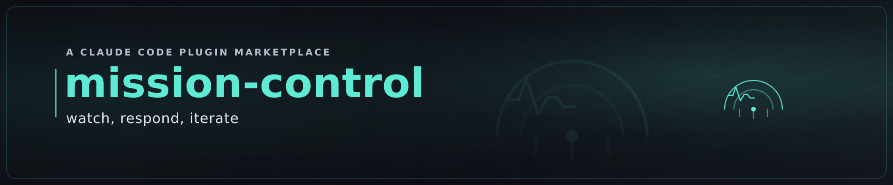

# MISSION-CONTROL — Operate the live product



> The mission doesn't end at launch — that's when mission control *starts*. Houston: telemetry,
> incidents, course-corrections.

![OPERATE telemetry strip animating the operate loop: a teal golden-signals sparkline ripples calmly (OBSERVE / HEALTHY) while the OBSERVE pip is lit; an incident spikes the line amber and trips a ⚠ alert (INCIDENT, RESPOND pip lights); a teal mitigation dot sweeps in and the bump decays back to baseline (MITIGATING → back inside SLO); the line settles flat teal (HEALTHY) with all three phase pips — OBSERVE, RESPOND, ITERATE ↻ — lit and a dashed learning arc curving from ITERATE back to OBSERVE, captioned "↻ what production teaches re-enters DISCOVER". The motion teaches observe → respond → iterate → loop.](../../docs/images/mission-control-operate.gif)

MISSION-CONTROL owns the **OPERATE** phase of the idea-to-production lifecycle — the post-launch,
living-in-production stage. Once a product is **realised & live**, this plugin keeps it alive and improving:
observe it, respond when it breaks, maintain it on a cadence, and close the loop by turning what production
teaches you into the next opportunity.

It works on **any** live project, standalone. It also serves as the **OPERATE** owner for the
[`i2p`](../i2p/) lifecycle: when both are installed, a confirmed re-entry signal advances the lifecycle
**OPERATE → DISCOVER (↻)**, opening the next value cycle. When i2p is absent, the operate cycle still runs
and simply emits markdown.

## What's inside

| Component | Lens | Command |
|---|---|---|
| **operate-gate** | front door → readiness + steady-state health, one verdict | `/operate-gate [readiness\|health\|path]` |
| **observability** | four golden signals · three pillars · SLI→SLO→alert | `/observability [path]` |
| **incident** | severity, ICS roles, mitigate-first, runbook, blameless postmortem | `/incident [declare\|runbook\|postmortem]` |
| **iterate** | build-measure-learn → a new OPPORTUNITY re-enters DISCOVER (↻) | `/iterate` |
| **maintain** | dependency upkeep, CVE patching, rotation, restore drills, tech-debt | `/maintain [path]` |
| **wiki-publisher** | opt-in: publish PRESSROOM's per-item docs + illustrations to the origin's GitHub `.wiki.git` | `/wiki-publisher [path]` |
| **flow** | the roadmap flow board — auto-run daemon serving the live SVG governance UI on the network, clickable URL in the statusline | `/flow [start\|stop\|status\|url\|build]` |
| **flow-setup** | finish setting up the **flow-server MCP** (the roadmap server — `render_roadmap` answers "what's on the roadmap" at ~0 tokens): pre-cache the binary, walk the one-time `/mcp` approval, verify the connection | `/flow-setup` |

`/operate-gate` is the front door — it certifies a product is **ready to operate** at go-live and gives the
**steady-state health view** once it's live, composing the other lenses into one report.

## The verdict

| Verdict | When | Action |
|---|---|---|
| **NOT-READY** | a readiness line missing that leaves incidents undetectable/unrecoverable, or an active SEV1/SEV2 | do not treat as operable |
| **WATCH** | operable but a named risk needs attention (error budget burning hot, overdue maintenance) | act on the named risk |
| **READY** | every readiness line evidenced; SLOs inside budget; no open major incident; maintenance current | cleared to operate / flying clean |

The verdict is the **worst across all lenses** — a clean dependency audit never offsets a missing rollback
path. A lens that can't fully run (missing tool/telemetry) reports *partial coverage* and never returns a
false READY.

## Install

```
/plugin marketplace add whatbirdisthat/idea-to-production
/plugin install mission-control@idea-to-production
```

## Design principles

- **Grounded in named canon, not vibes** — every judgment cites the OPERATE discipline (SRE SLIs/SLOs/error
  budgets + the four golden signals, the Incident Command System, build-measure-learn, ITIL-lite
  maintenance). See [`knowledge/operate-canon.md`](knowledge/operate-canon.md).
- **No false "healthy"** — a signal isn't healthy because a tool is missing; every blind spot is disclosed
  in the report's Coverage & Gaps section.
- **The loop never dead-ends at launch** — OPERATE's learnings re-enter DISCOVER, so the lifecycle is a
  cycle, not a finish line.
- **Lights up its neighbours** — composes `sentinel`'s `/dependency-audit` for maintenance, hands a new
  opportunity to `market-scanner`/`ideator`, and advances the `i2p` lifecycle — all *by capability*,
  degrading gracefully when a companion is absent.

## ♻️ Self-improvement covenant — halve the distance to perfection

Every component of MISSION-CONTROL carries the KAIZEN self-improvement covenant: each iteration must **at
least halve the remaining distance to perfection** — every incident that surprised us becomes a runbook and
a signal, every noisy alert becomes a tightened threshold, every upkeep emergency becomes a scheduled
cadence item — so the next operate cycle catches more, sooner, and is quieter. This is the shared discipline
of the idea-to-production marketplace. See [`knowledge/covenant.md`](knowledge/covenant.md).

## License

Dual-licensed under **MIT OR Apache-2.0**.
