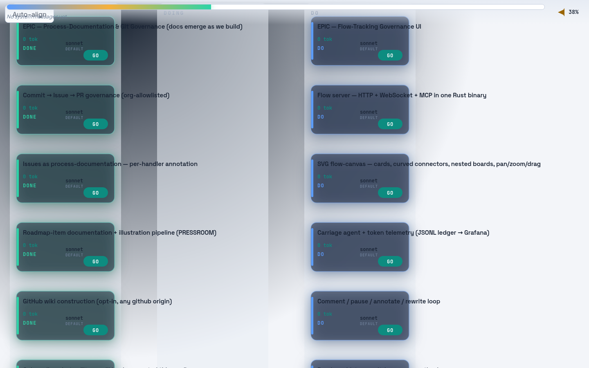

# Flow server — the Flow-Tracking Governance UI

The standing **observability/governance interface** of the idea-to-production value system: a per-project
local web app that renders the live roadmap as an interactive SVG board the human steers. One Rust binary
serves the UI, a WebSocket delta stream, and a token-gated MCP endpoint; a vanilla-JS canvas draws the
roadmap as cards in DO·DOING·DONE columns.



*Above: the running server with this repository's own `mission-control` roadmap ingested — 16 items across
two epics, the masthead reading 38% complete (the six shipped epic-#9 items in DONE).*

## What it does (epic #0, roadmap items #1–#8, #15)

| Item | Capability |
|------|-----------|
| **#1** | One Rust binary: HTTP + WebSocket + MCP on one router, **sole serialized writer** of the roadmap markdown + JSONL event log, **bearer-token** on every surface, stable slug IDs, cycle/broken-dep graph guard |
| **#2** | SVG flow-canvas: rounded-rect cards · curved connectors · DO·DOING·DONE boards · wheel-zoom-about-cursor · click-drag pan · card drag · auto-align · WAIT/GO toggle · badges |
| **#3** | Carriage telemetry: ancestor **token roll-up** (a spend on a child accrues up the dependency tree) → `telemetry.jsonl` → (graceful) local Grafana |
| **#4** | Comment / pause / annotate / rewrite: typing pauses the item, Ctrl-Enter annotates its plan, a rewrite request bumps the draft# |
| **#5** | Roadmap ingest (`--roadmap`) + git-log proxy synthesis for projects that adopted the roadmap late |
| **#6** | Masthead progress bar + pac-man completion gauge (DONE fraction → "run & observe" at 100%) + system-message feed |
| **#8** | Per-job model selection: default shown, per-card override (Haiku/Sonnet/Opus/Fable) |
| **#15** | `render_roadmap` — "what's on the roadmap" answered by local compute (MCP/REST), ~0 LLM tokens |

## Run it

```bash
cargo run --bin flow-server -- \
  --host 127.0.0.1 --port 7433 \
  --data .flow --static plugins/mission-control/flow-server/static \
  --roadmap plugins/mission-control/ROADMAP.md
# → open http://127.0.0.1:7433/?token=<the token printed to stderr / .flow/token>
```

`--host` defaults to LAN-reachable; the token is generated to `--token` (default `.flow/token`) on first run
and required on every HTTP/WS/MCP request.

## Architecture

A **pure domain core** (`src/domain/`: ids · model · graph · event · telemetry · roadmap_view · annotation —
no IO, parse-don't-validate, no cycles by construction) behind **thin adapters** (`store.rs` the one writer ·
`auth.rs` token gate · `api.rs` REST · `ws.rs` broadcast · `mcp.rs` 13-verb JSON-RPC). The single source of
truth is the roadmap markdown + the append-only JSONL log; the UI is a view.

## Tests

- **Rust**: `cargo test` → 277 tests; `cargo clippy -D warnings` + `cargo fmt --check` clean; domain core and
  every new module at **100% line+region**, `main.rs` the only excluded shim (an entrypoint, e2e-smoked).
- **Frontend**: `cd static && npm test` → 164 vitest+jsdom tests, 100% coverage.
- **Live**: booted with the real roadmap ingested; HTTP/WS/MCP exercised end-to-end (token-reject, 9→13
  verbs, cycle-reject, REST+MCP through the one writer, board renders all 16 items — see the screenshot).

← back to the [mission-control plugin](../README.md) · the [marketplace root](../../../README.md)

## MCP registration (stdio transport)

The flow-server speaks the [MCP stdio transport](https://modelcontextprotocol.io/docs/concepts/transports)
when started with `--mcp`. This repo's `.claude/settings.json` registers it so the tools
(`list_items`, `render_roadmap`, `post_status`, `set_wait_go`, `append_spend`) appear automatically
in every Claude Code session opened from the repo root.

**First run** — `cargo run` will compile the binary on first invocation (30-60 seconds). Subsequent
calls reuse the compiled artifact.

**Production mode** (faster startup after `cargo build --release`):
Update the `args` in `.claude/settings.json` to point at the compiled binary:
```json
{
  "mcpServers": {
    "flow-server": {
      "command": "plugins/mission-control/flow-server/target/release/flow-server",
      "args": ["--mcp"]
    }
  }
}
```

The binary reads `.flow/` from the **current working directory** when invoked by the MCP harness.
Run Claude Code from the repo root so the store path resolves correctly.
