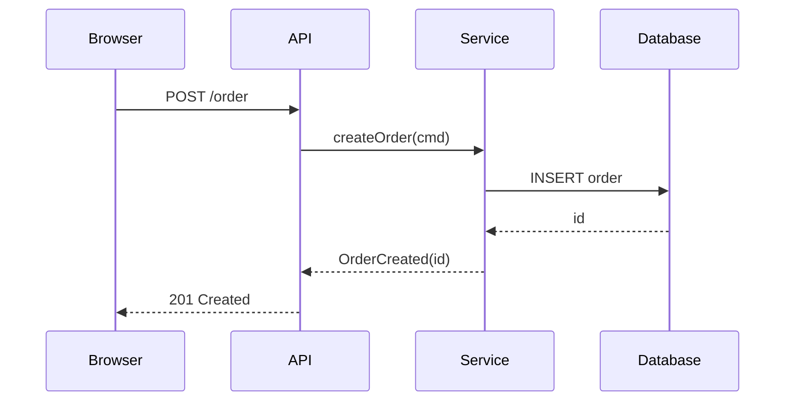
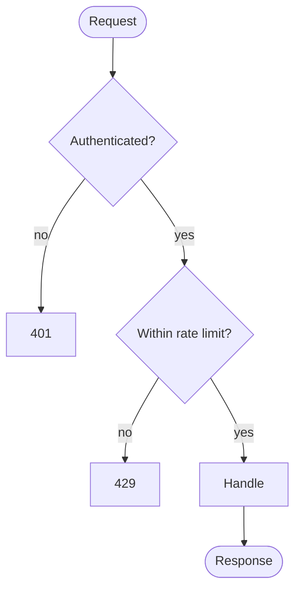
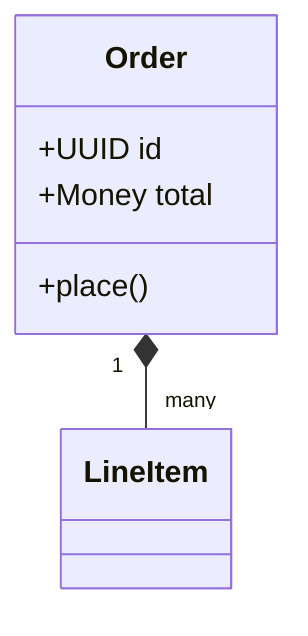
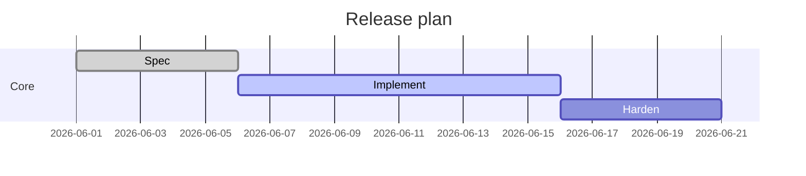
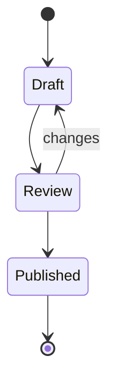
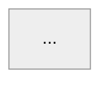

# Mermaid Patterns — recipes and when to prefer Mermaid

Mermaid's strength is diagrams that live **as source inside markdown**, drawn by the renderer
(GitHub, GitLab, most docs sites, many wikis). When the target renders Mermaid, emit the source
in a fenced block — don't pre-render. When it doesn't, render to SVG with `mmdc` (the Mermaid
CLI) and embed the image.

> Legibility still governs: the 4×9 charting-matrix intuition applies — keep node counts modest,
> break a sprawling graph into several. See `../../rich-pdf-with-diagrams/references/charting-matrix.md`.

---

## When to prefer Mermaid over Graphviz

| Prefer Mermaid | Prefer Graphviz |
|---|---|
| Sequence diagrams (interactions over time) | Architecture / dependency graphs |
| Gantt / simple timelines | Anything needing precise layout control (clusters, ranks) |
| Class / ER diagrams from a known schema | Wide fan-outs wrapped to rows |
| Diagram should stay editable inline in markdown | Print/PDF vector output |

---

## Sequence diagram



Keep participants ≤6; past that, split the interaction or group participants into boxes
(`box ... end`).

## Flowchart



Use `TB` for documentation (tall column); `LR` for slides (wide). Label every decision edge.

## Class diagram



## Gantt (roadmaps/timelines)



## State diagram



---

## Rendering when the target can't draw Mermaid

```bash
mmdc -i diagrams/01-flow.mmd -o diagrams/01-flow.svg     # vector for web/markdown
mmdc -i diagrams/01-flow.mmd -o diagrams/01-flow.png -s 2 # 2× raster if SVG unsupported
```

Then embed the rendered file: ``.

---

## Accessibility

Add an accessible title/description so the diagram is not opaque to screen readers:



For rendered SVG, ensure the `<svg>` carries a `<title>` and `<desc>` (mmdc emits these from
`accTitle`/`accDescr`).

---

## Self-improvement

New Mermaid recipe or a legibility lesson? Add it here, and if the lesson is about composition
(too many nodes, wrong direction for the target), generalise it into the shared charting-matrix
via `../../rich-pdf-with-diagrams/references/self-improvement.md`.
