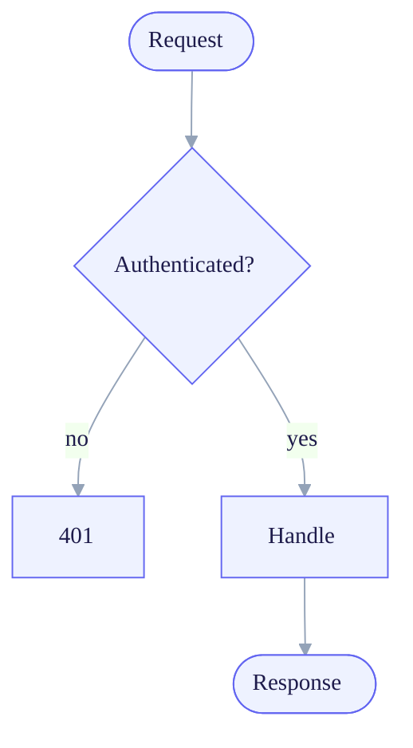

# Mermaid theming, layout (ELK) & accessibility

> Default Mermaid looks like default Mermaid. A composed diagram is themed to a disciplined palette, laid
> out so edges don't cross needlessly, and described for screen readers. This is the difference between a
> diagram that looks *generated* and one that looks *designed*.

## Theming via the `%%{init}%%` directive

Mermaid reads a per-diagram config from an init directive on the first line. Start from a **base theme**
and override a few `themeVariables`:



Rules that keep theming honest:
- **Built-in themes:** `default`, `base`, `neutral`, `dark`, `forest`. **`base` is the only one designed
  to be customised** via `themeVariables` — start there for brand work.
- **Hex only.** The theming engine accepts color values, **not** names: `'#ff0000'` works, `'red'` does
  not. Mermaid auto-derives some secondary/tertiary colours to preserve contrast when you change primaries.
- **A few variables, not all.** The high-leverage ones: `primaryColor`, `primaryBorderColor`,
  `primaryTextColor`, `secondaryColor`, `tertiaryColor`, `lineColor`, `background`, `fontFamily`,
  `fontSize`. Set a coherent neutral + one accent; let derived values do the rest.
- **Per-type styling:** `classDef`/`class` in flowcharts, and `style <id> fill:…,stroke:…` for one-off
  emphasis. Use emphasis sparingly (Von Restorff — the highlighted node is the one that matters).
- **Don't signal by colour alone** — pair colour with shape/label so the meaning survives greyscale and
  colour-blindness (this is also the [`design-reviewer`](../../design-reviewer/SKILL.md)'s rule).

> **Site-wide vs per-diagram.** For a whole site you'd `mermaid.initialize({ theme, themeVariables })`;
> inside a document, the per-diagram `%%{init}%%` directive is the portable choice and is what `mmdc`
> honours. Some host renderers restrict directives via a `secure` array — when a host strips your theme,
> render with `mmdc` instead and embed the SVG.

## Layout — the default engine vs ELK

Mermaid's default layout (dagre) is fine for small graphs. For **larger or denser** diagrams, switch to
the **ELK** layout engine for markedly better edge routing and node placement. The canonical,
engine-wide selector (Mermaid ≥ v10.3) is the top-level **`layout`** key — it reaches flowcharts, state
diagrams, and others:

```mermaid
%%{init: {'layout':'elk', 'elk': {'mergeEdges': true, 'nodePlacementStrategy':'NETWORK_SIMPLEX'}}}%%
flowchart LR
  …
```

- Use `{'layout':'elk'}` — **not** the legacy `{'flowchart': {'defaultRenderer':'elk'}}`, which is the
  original experimental form and ELK-ifies **flowcharts only** (it silently no-ops on a state diagram).
- ELK is **not bundled** in every integration — `mmdc` supports it; some host renderers don't. When ELK
  is unavailable, fall back to the default engine **and decompose** rather than ship a tangled graph.
- Useful ELK knobs (under the `elk` key): `mergeEdges` (combine parallel edges), `nodePlacementStrategy`
  (`BRANDES_KOEPF` / `NETWORK_SIMPLEX` / `LINEAR_SEGMENTS` / `SIMPLE`). Tune only when the default routing
  is genuinely poor — most legibility problems are solved by *fewer nodes*, not a different engine.

## Accessibility — `accTitle` / `accDescr`

Every diagram declares:

```
accTitle: Short name of the diagram
accDescr: One sentence on what it shows and the takeaway.
```

For a longer, multi-line description, use the **block form**:

```
accDescr {
  Authenticated, rate-limited requests are handled; others are rejected.
  The happy path is the rightmost column.
}
```

`mmdc` emits these as `<title>` and `<desc>` on the SVG, so assistive tech and search can read the figure.
A diagram without an accessible description is **not done**.

## Limitations to design around

- **Layout control is coarser than Graphviz** — you steer with direction (`TB`/`LR`), ranks, subgraphs,
  and ELK, not absolute positions. For pixel-precise architecture layouts, `diagram-studio`'s Graphviz
  path is the better tool; for everything Mermaid expresses natively (sequence, state, gantt, journey,
  sankey, …) Mermaid is clearer and stays editable as source.
- **Theming is variable-driven**, not arbitrary CSS (except inline SVG post-render). Work within
  `themeVariables` + `classDef`.
- **Beta types** (sankey/xychart/radar/treemap/packet/architecture) evolve — verify the target supports
  them, or render with `mmdc` and embed.

> **Self-improvement.** A theming or layout lesson (a variable that always needs setting, an ELK threshold)
> belongs here; a *composition* lesson (too many nodes) generalises into the shared charting-matrix.
