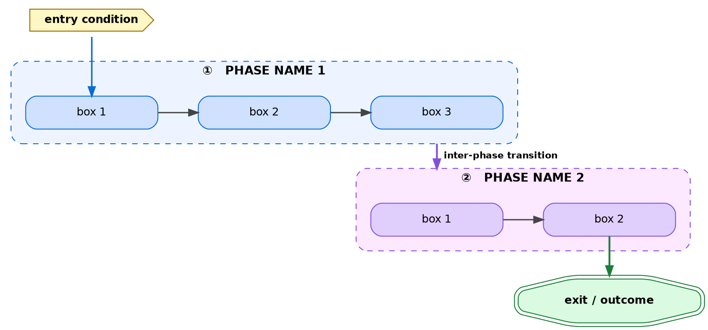
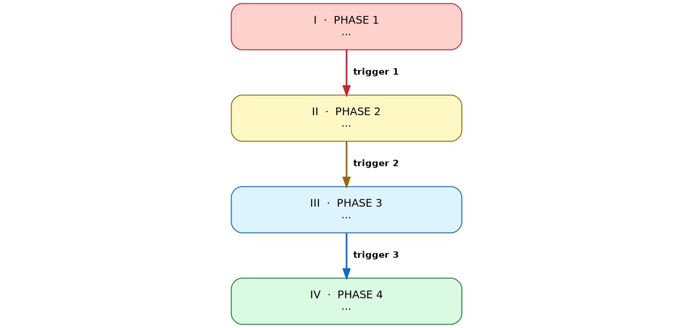
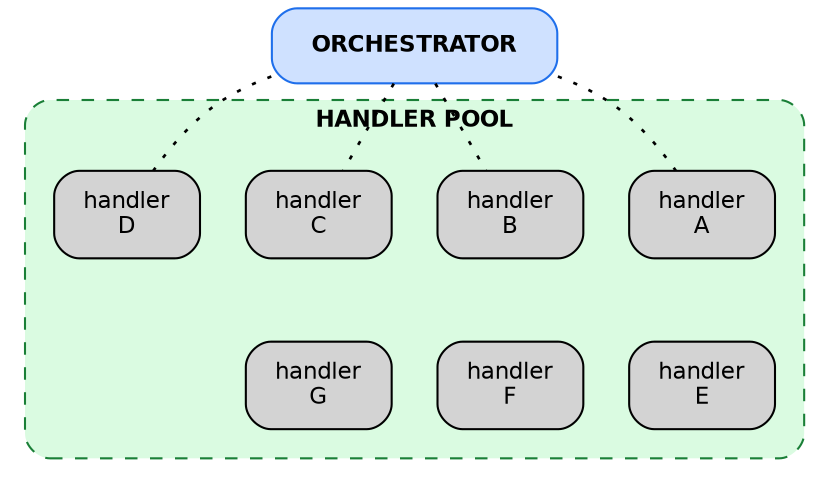
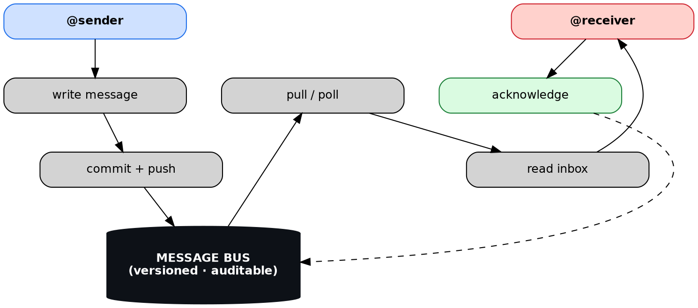
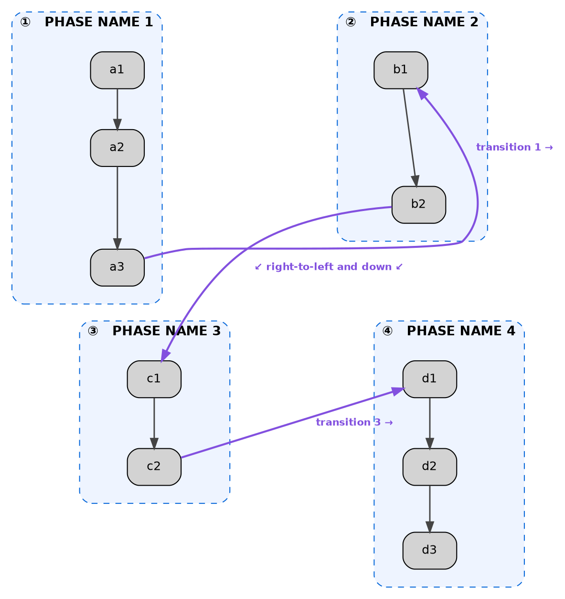
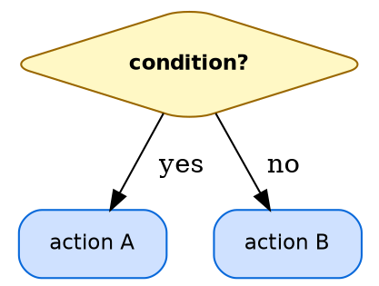

# Graphviz Patterns — Reusable DOT Recipes For A4 Diagrams

> **Pick a pattern, copy it, edit the content.** Do not design from
> scratch. The patterns below have been tested against the charting
> matrix and produce diagrams that obey the rules by construction.

---

## Pattern 0 — Universal preamble

Every diagram begins with this preamble. Copy-paste, then customise.

```dot
digraph DiagramName {
  rankdir=TB;
  bgcolor="transparent";
  splines=spline;
  ranksep=0.50;
  nodesep=0.30;
  compound=true;
  node [shape=box, style="rounded,filled", fontname="Helvetica",
        fontsize=12, margin="0.22,0.14"];
  edge [fontname="Helvetica", fontsize=10, color="#444444", penwidth=1.3];
  ...
}
```

The palette (use these named hex codes for visual consistency across all
diagrams):

| Role | Background | Border | Text |
|------|-----------|--------|------|
| Default / muted | `#f6f8fa` | `#57606a` | — |
| Action / step (blue) | `#cfe1ff` | `#0969da` | — |
| Sentinel / contract (yellow) | `#fffbcc` / `#fff8c5` | `#9a6700` | — |
| Reviewer / audit (purple) | `#e0cffc` / `#fce8ff` | `#8250df` | — |
| Success / shipped (green) | `#dafbe1` / `#b6f5b6` | `#1a7f37` | — |
| Failure / warning (red) | `#ffd1cc` / `#ffe5e0` | `#cf222e` | — |
| Strong / central anchor | `#0d1117` | `#0d1117` | `#ffffff` |

---

## Pattern 1 — Multi-phase TB stack with clusters (the canonical pattern)

**Use for:** any workflow with 3-5 named phases, each containing 2-3
elements. This is the **default** pattern for most diagrams.



**Key tricks:**
- `{ rank=same; a1; a2; a3; }` *inside* the cluster keeps elements
  horizontal — without it Graphviz would stack them vertically.
- `compound=true` plus `ltail`/`lhead` on inter-cluster edges draws the
  arrow from the *edge* of the cluster, not from a specific node inside.
- Each cluster gets its own colour family. Use the palette table.

---

## Pattern 2 — Staggered ladder (4+ phases, alternating L/R)

**Use for:** any linear chain of 4+ elements where Pattern 1 would feel
sparse. The four-phases-of-developer-posture diagram uses this.



**Key tricks:**
- `shape=point, width=0.01, style=invis` creates a zero-size invisible
  anchor.
- `minlen` on invisible edges controls horizontal distance: `minlen=1`
  pulls close, `minlen=4` pushes far.
- The visible `p_i -> p_{i+1}` edges automatically render as diagonals
  because of the alternating L/R positioning.

---

## Pattern 3 — Wide fan-out wrap (1 → N handlers)

**Use for:** orchestrator-to-workers, central node fanning out to
multiple specialists. Examples: DELIVER → 7 handlers; service → multiple
adapters.



**Key tricks:**
- Two `{ rank=same; ... }` blocks define two horizontal rows.
- Invisible edges between rows force Graphviz to keep them separate.
- Limit row 1 to **4 boxes**; subsequent rows can have fewer.

---

## Pattern 4 — Tabular timeline (vertical event list)

**Use for:** timelines, change logs, retrospective event chains.
Replaces a horizontal `rankdir=LR` chain that would be illegibly thin.

```dot
digraph Timeline {
  rankdir=TB;
  bgcolor="transparent";
  splines=line;
  ranksep=0.10;
  nodesep=0.05;
  node [shape=plaintext, fontname="Helvetica"];
  edge [arrowhead=none, color="#7d8590", penwidth=1.6];

  t1 [label=<<TABLE BORDER="0" CELLBORDER="1.5" CELLSPACING="0"
                CELLPADDING="9" COLOR="#cf222e">
       <TR>
         <TD BGCOLOR="#ffd1cc" WIDTH="180" ALIGN="LEFT" VALIGN="MIDDLE">
           <FONT FACE="Helvetica-Bold" POINT-SIZE="13" COLOR="#cf222e">
             DATE
           </FONT><BR/>
           <FONT POINT-SIZE="10" COLOR="#57606a">commit-hash · time</FONT>
         </TD>
         <TD BGCOLOR="#fff5f3" WIDTH="430" ALIGN="LEFT" VALIGN="MIDDLE">
           <FONT POINT-SIZE="12" FACE="Helvetica-Bold">headline</FONT>
           <BR/>
           <FONT POINT-SIZE="10" COLOR="#444">description line 1<BR/>
           description line 2</FONT>
         </TD>
       </TR></TABLE>>];

  // t2, t3, ... follow the same template with different colours
  t1 -> t2 -> t3 -> ...;
}
```

**Key tricks:**
- `shape=plaintext` plus HTML-like `<TABLE>` labels gives true tabular
  layout that Graphviz cannot do with native shapes.
- Two cells per row: left = date/anchor, right = description.
- Width values (180 / 430) match the A4 textblock proportions.
- Chain rows top-to-bottom with edges that have `arrowhead=none` for a
  clean ribbon look.

---

## Pattern 5 — Two-actor message bus

**Use for:** inter-process or inter-agent coordination over a shared
medium. Two actors flank a central anchor.



**Key tricks:**
- Top row contains the two actors via `rank=same`.
- The cylinder shape is the conventional choice for "the bus".
- Symmetric `rank=same` constraints lower in the diagram keep the two
  columns aligned visually.

---

## Pattern 6 — Layered architecture (front → back → store)

**Use for:** system stack diagrams. The FootyManager system-stack
diagram (exemplar 01) uses this.

```dot
digraph SystemStack {
  rankdir=TB;
  bgcolor="transparent";
  splines=ortho;
  node [shape=box, style="rounded,filled", fontname="Helvetica",
        fontsize=11, margin="0.20,0.12"];

  subgraph cluster_layer1 {
    label="UI / FRONTEND LAYER";
    fontname="Helvetica-Bold"; fontsize=11;
    color="#1f6feb"; bgcolor="#eef4ff";
    style="rounded,dashed";
    // 3-4 boxes inside, each describing a frontend concern
  }

  subgraph cluster_layer2 {
    label="API / SERVER LAYER";
    fontname="Helvetica-Bold"; fontsize=11;
    color="#cf222e"; bgcolor="#fff0ee";
    style="rounded,dashed";
    // 3-4 boxes inside
  }

  subgraph cluster_layer3 {
    label="DOMAIN / LOGIC LAYER";
    fontname="Helvetica-Bold"; fontsize=11;
    color="#1a7f37"; bgcolor="#ecffe8";
    style="rounded,dashed";
    // 3-4 boxes inside
  }

  subgraph cluster_layer4 {
    label="STORAGE LAYER";
    fontname="Helvetica-Bold"; fontsize=11;
    color="#8250df"; bgcolor="#f4ecff";
    style="rounded,dashed";
    // 2-3 boxes inside
  }

  // Inter-layer arrows go from outer-most boxes of each cluster
}
```

**Key tricks:**
- Each layer is a labelled cluster with a unique colour family.
- Use `splines=ortho` for clean right-angle connectors when layers are
  rectangular blocks.
- Layer labels include a noun ("UI / FRONTEND LAYER") not just a number.

---

## Pattern 8 — Zig-zag panel grid (THE canonical pattern for 3–4 phases)

**Use for:** any multi-phase workflow with 3 or 4 phases, each
containing 2-3 elements. **This pattern replaces Pattern 1 whenever
there are more than 2 phases.** It is the single biggest cure for the
"diagram is tiny on the page" failure mode (F7).

**Visual layout:**
```
[ ① PHASE 1 ]                        [ ② PHASE 2 ]
   box A1                                box B1
   │                                     │
   box A2                                box B2
   │                                     │
   box A3 ────────── (rightward) ─────→  (entry)
                                         │
                                         ↓ (down)
                                         box B3
                                         │
                          (down-left)    │
        ┌────────────────────────────────┘
        │
        ↓
[ ③ PHASE 3 ]                        [ ④ PHASE 4 ]
   box C1                                box D1
   │                                     │
   box C2 ────────── (rightward) ─────→  box D2
                                         │
                                         ↓
                                         box D3
```

Reading order is left→right on row 1, then **right-to-left and down**
to row 2 (the diagonal arrow that catches the reader's eye), then
left→right on row 2.

**DOT skeleton:**



**Key tricks:**
- `newrank=true` is REQUIRED for `rank=same` to operate across
  cluster boundaries in TB mode. Without it, ranking is local to each
  cluster.
- The `rank=same` blocks pair the **first** node of each row's panels,
  not the cluster itself (Graphviz cannot rank clusters directly).
- Invisible edges with `minlen=3` enforce horizontal spacing.
- Invisible vertical edges (`a3 -> c1`, `b2 -> d1`) keep the left-column
  panels above each other and same for the right column.
- The diagonal `b2 -> c1` transition (the "right-to-left and down" arrow)
  is the visual signature of the pattern — make it visible and labelled.
- All inter-panel transitions use `constraint=false` so they do not
  affect the grid layout, only render visually.

**Three-phase variant:** for 3 phases use the same skeleton minus P4.
Place P3 either in bottom-left (with bottom-right empty — wider P3 box
fills the row) or bottom-spanning the full width. Reading flow becomes
P1 → P2 → (down-and-left) → P3.

**Anti-pattern check:** before writing this pattern, confirm that you
are NOT doing the horizontal-band layout (Pattern 1 with `{ rank=same;
a1; a2; a3; }` *inside* the cluster). Pattern 1's horizontal-band
layout is for **single-phase** wide rows or **small** 2-phase
workflows. Anything with 3+ phases must use this pattern instead.

---

## Pattern 7 — Decision tree (branching TB)

**Use for:** decision flowcharts, if/else logic, classification trees.



**Key tricks:**
- Use `shape=diamond` for decision points.
- Label every edge with the condition's outcome.
- Never branch >3 ways from a single node — refactor to nested
  diamonds.

---

## When patterns are not enough

If your diagram does not fit any of these patterns, do **not** invent a
new approach. Instead:

1. Identify the closest pattern from the table above.
2. Decompose the diagram so the closest pattern can carry it.
3. If multiple patterns are needed, **produce multiple diagrams** rather
   than one complex one.

The cost of a clean second diagram is much lower than the cost of a
confusing single diagram.
