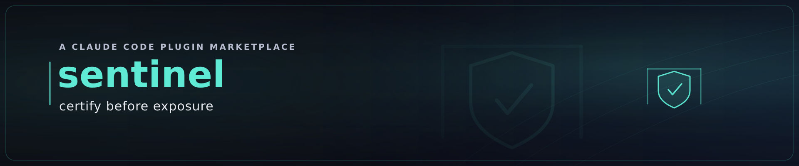

# SECURE — Security & Privacy Gate



> Never ship a leaked key, a real person's data, or a vulnerable dependency.

SECURITY is the pre-release security gate for any repository. It runs three parallel audit lenses
and consolidates them into a single severity-ranked report with one verdict — **PASS / REVIEW /
BLOCK**.

![Animated security gate: a teal-titled "SECURITY · certify before exposure" panel shows an artifact at left, three stacked lens chips in the centre (PII, SECRETS, SUPPLY-CHAIN), and a closed gate at right reading "0/3 lenses". An amber scan sweep marches across the chips; as it reaches each lens the chip flips from dim "pending" to amber "scanning…" to a green-checked teal "sealed". When all three are sealed the gate's "0/3 lenses" label resolves to a large teal "PASS · cleared to expose →" stamp, then holds — teaching certify-before-exposure: nothing is cleared until every lens seals green.](../../docs/images/sentinel-gate.gif)

It works on **any** project, standalone. It also serves as the **SECURE value-station** for the
[`deliver`](../deliver/) plugin: when both are installed, deliver runs `/secure:scan-all` before
delivery and halts on a BLOCK. When SECURITY is absent, deliver simply ships markdown and notes
that the gate was skipped (*graceful enhancement* — no hard dependency either way).

## What's inside

| Component | Lens | Command |
|---|---|---|
| **scan-all** | orchestrator → one report, one verdict | `/secure:scan-all [full\|quick\|path]` |
| **scan-for-pii** | personal data (names, emails, IDs, financial, health) | `/secure:scan-for-pii [full\|data\|git\|code\|spa\|path]` |
| **scan-for-secrets** | credentials (API keys, tokens, private keys, connection strings) | `/secure:scan-for-secrets [full\|tree\|history\|path]` |
| **scan-dependencies** | supply chain (vulns, unpinned, abandoned, typosquats) | `/secure:scan-dependencies [path]` |

`/secure:scan-all` is the front door — it fans out the other three in parallel and merges them.
Run the individual commands when you want one lens fast (e.g. `/secure:scan-for-secrets tree` pre-commit).

## The verdict

| Verdict | When | Action |
|---|---|---|
| **BLOCK** | any CRITICAL (live credential, special-category PII, critical/high vuln, private key) | do not ship |
| **REVIEW** | a HIGH or unresolved MEDIUM | human decision required |
| **PASS** | only documented LOW/MINIMAL | clear to ship; keep the report as evidence |

The verdict is the **max severity across all lenses** — a clean PII scan never offsets a leaked
key. A lens that can't fully run (missing advisory tool) reports *partial coverage* and never
returns a false PASS.

### Gate failure — what to do

A **REVIEW** or **BLOCK** verdict is the **SECURE → BUILD** back-edge of the BUILD ⇄ ASSURE ⇄ SECURE
loop, not a dead end. When `/secure:scan-all` returns non-PASS:

1. **Open the report** — `SECURITY-REPORT.md`. The Findings sections name each leaked secret, exposed
   PII, or vulnerable dependency with its locus and severity.
2. **Fix in BUILD** — remediate the named findings (rotate/remove the secret, redact the PII, bump or
   pin the dependency, re-commit). This re-enters the **BUILD** phase; when i2p is installed,
   `/secure:scan-all` fires `/i2p:lifecycle fail SECURE`, sending the lifecycle back to BUILD and
   incrementing the loop counter (status line `⇄ ×N`).
3. **Re-run the gate** — `/secure:scan-all` again over the fixed tree.
4. **The loop exits only when all three gates are green** — BUILD shipped, ASSURE
   (`/deliver:pr-review`) PASS, and SECURE PASS — at which point `done SECURE` advances to PUBLISH.

## Install

```
/plugin marketplace add whatbirdisthat/idea-to-production
/plugin install secure@idea-to-production
```

## Design principles

- **Three distinct lenses, kept separate** — personal data, credentials, and supply chain are
  different questions; mixing them dilutes each.
- **No silent passes** — every gap (skipped tree, missing tool, applied exclusion) is disclosed
  in the report's Coverage & Gaps section.
- **Never re-leak** — matched secrets are redacted to ≤4 leading characters; the report is itself
  committed.
- **Self-improving** — every missed pattern becomes a rule; every false positive becomes a
  narrow allowlist entry. The next scan starts stricter than the last.

Planned capabilities (license compliance, SBOM, CI recipes, IaC scanning, …) are tracked on the GitHub project board.

## ♻️ Self-improvement covenant — halve the distance to perfection

Every component of SECURITY carries the KAIZEN self-improvement covenant: each iteration must **at
least halve the remaining distance to perfection** — every missed pattern becomes a rule, every
false positive a narrow exclusion, every new failure mode a guardrail — so the next scan starts
stricter than the last and recurring gaps are fixed *upstream, once*. This is the shared discipline
of the idea-to-production marketplace.

## License

Dual-licensed under **MIT OR Apache-2.0**.
